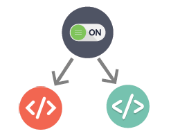
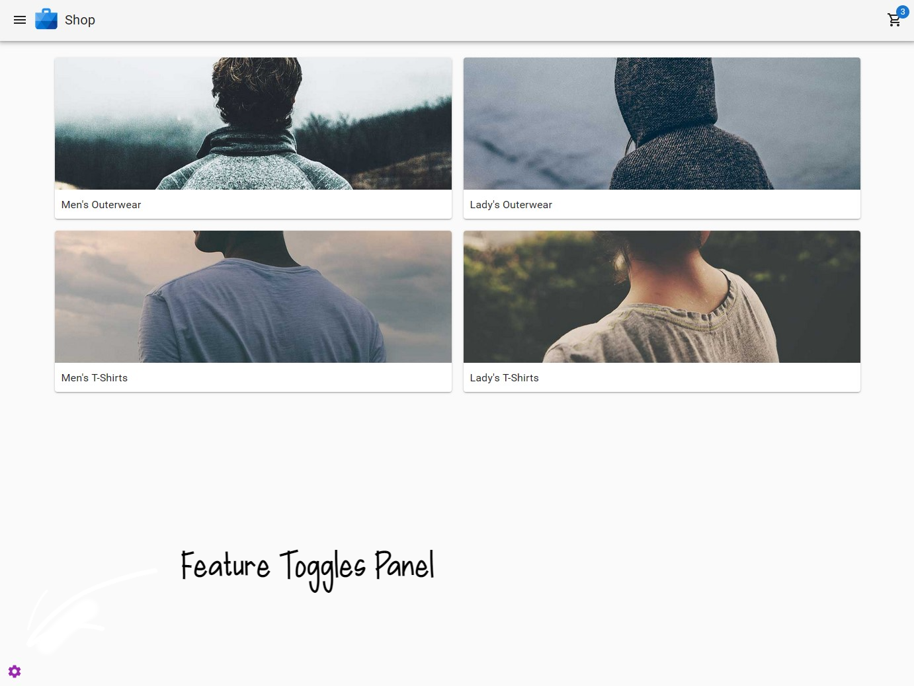
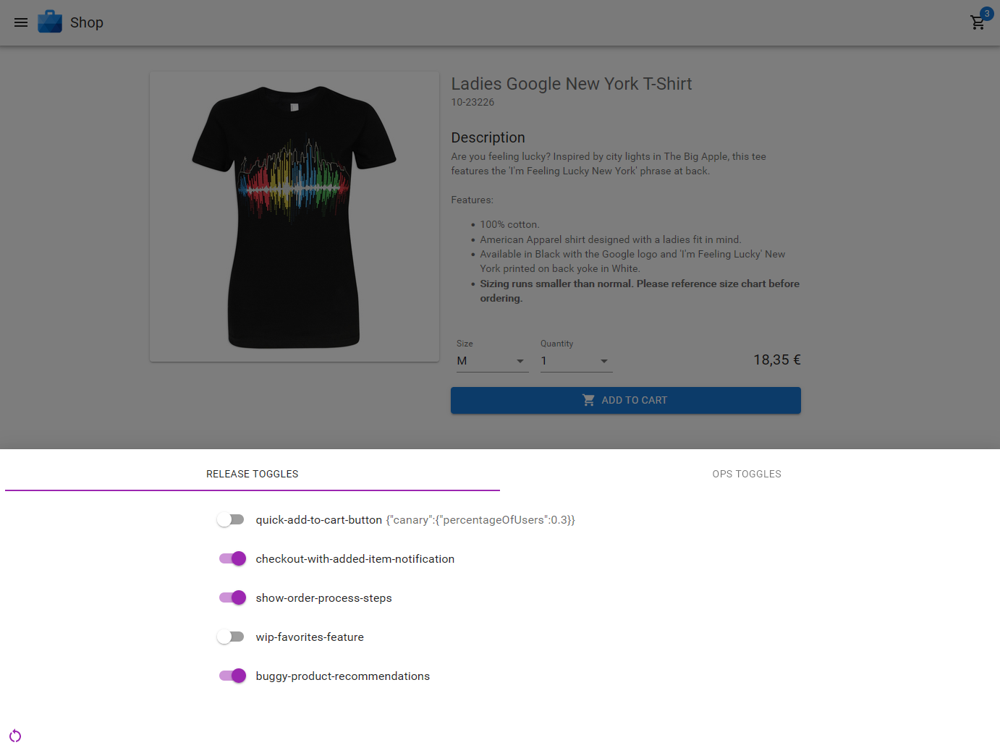
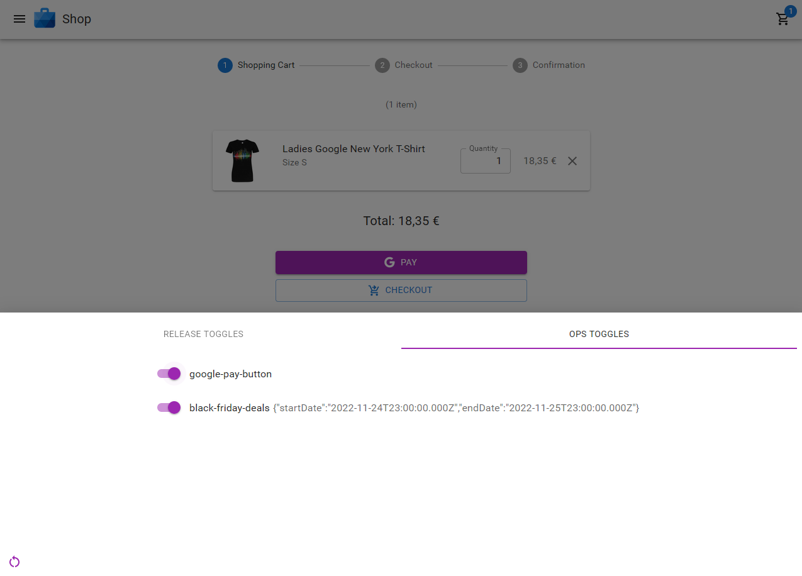
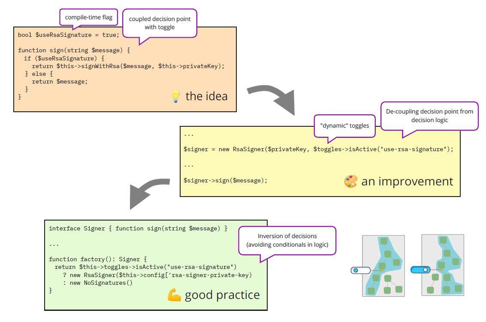
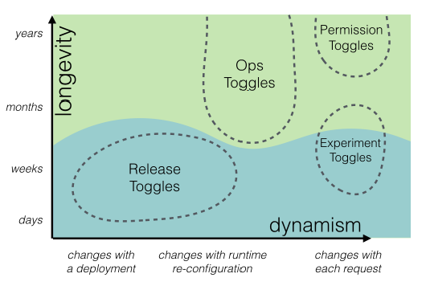
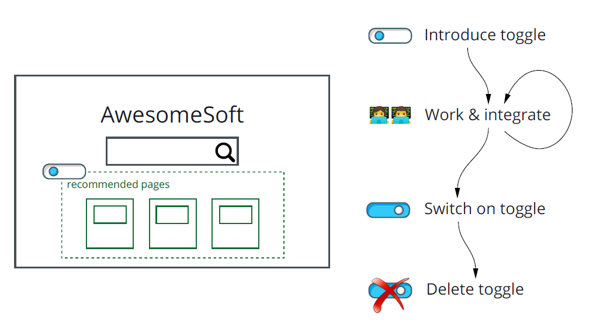
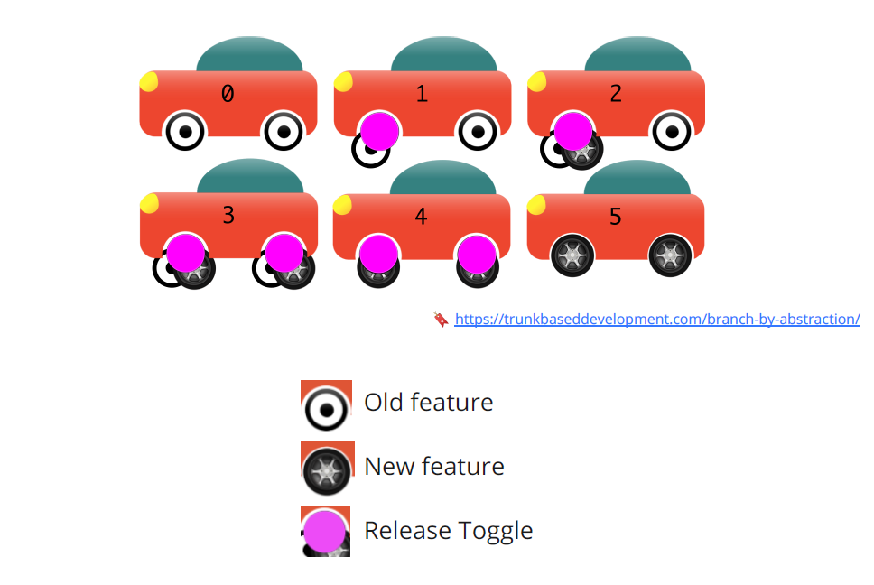

# Feature Toggles Visual Demo


[Feature Toggles](https://www.martinfowler.com/articles/feature-toggles.html) are a powerful tool for development teams (including business persons) to deliver functionality quickly and safely, by decoupling code deployment from feature deployment.

> Feature Toggles decouple code deployment from feature deployment; thus, enabling true Continuous Delivery.

In simple terms, a feature toggle is an on-off switch for some part of the software system, which can be turned on or off after the deployment.



This mechanism enables teams to decide when a certain feature goes live, have a kill-switch when something isn't working as intended, not having unfinished code block deployment, do calender-driven launches, do A/B testing, and much more.

Further, this decoupling of code and feature deployment alleviates pressure from developers to _finish_ a feature, making _feature freezes_ and long-running feature-branches unnecessary, enables on-demand releases, and simplifies the workflow (cf. [trunk-based development](https://trunkbaseddevelopment.com/feature-flags/)).

You can find more information about feature toggles in the subsequent sections and provided links.

## 💻 This Demo

This demo is intended as a presentation for non-developers to visualize how features toggles help development teams decouple code deployment from feature deployment.

[You can try the demo here](https://andrej-dyck.github.io/feature-toggles-visual-demo/).





### Run Locally

```[shell]
git clone https://github.com/andrej-dyck/feature-toggles-visual-demo.git \
 && cd feature-toggles-visual-demo \
 && yarn install \
 && yarn build \
 && yarn preview
```

Then open [http://localhost:8080/feature-toggles-visual-demo/]()

## 🎓 For Developers and Inquiring Minds

Feature Toggles are nothing new and are used by small and large software systems alike. They allow development teams to work on features and integrate their code with confidence.

With feature toggles, changes can be tested and approved independent of code deployment, they can be rolled out incrementally (cf. [canary release](https://launchdarkly.com/blog/what-is-a-canary-release/)), or, most importantly, easily reverted by switching off the toggle.

### Basic Idea

The basic idea of a feature toggle is an if-else that can be configured at runtime. It can be as simple as hiding a UI element to changing behavior or performance.



While compile-time flags are sometimes good enough, it is a good practice when toggles can be switch on/off the toggles without the need to re-deploy code.

Further, to improve code design and minimize complexity by avoiding conditionals in logic, toggles should create dependency graphs as close to the client as possible.

### Feature Toggles vs Feature Flags

In most literature, _feature toggles_ and _feature flags_ are synonyms (along with _feature switch_, _feature gate_, _feature flipper_).

For me, a flag is the _named on-off switch_ and the toggle is the corresponding _technical decision point_.

### Types of Feature Toggles

There are several types of feature toggles. [Martin Fowler's article](https://www.martinfowler.com/articles/feature-toggles.html) describes four types of toggles:



For developers, the most used ones are _release toggles_. This is why, _feature toggles_ and _release toggles_ are often used as synonyms.

In this demo, I only used _release_ and _ops toggles_, because I would argue that _experiment_ and _permission toggles_ can be seen as a subset of _release_ and _ops toggles_, respectively.

### Caution!

While feature toggles have many benefits, they introduce complexity to the code base and require a discipline to manage the overhead and clean-up later (that way, toggles are similar to [technical debt](https://www.productplan.com/glossary/technical-debt/)).

In other words, the usage of feature toggles has some costs, and thus, we need to consider the cost-benefit ratio on a case-by-case basis.

For example, changing the style of a UI element could be considered by many applications a low risk scenario. So, a feature toggle might be too costly and a fix could be released with the next build.

Other times, we can work on a feature without affecting the rest of the application. Further, we can reduce visibility and/or user input of new features; e.g., by providing a view without a menu item or showing data as readonly.

Another (rather extreme) example, is the change or upgrade of an important dependency (e.g., framework). Here, we probably have technical difficulties to build a project with two versions of the same dependency. However, we might be able to deploy and run two copies of the application (with the old and new dependency version) and move the toggle into a load balancer or star script.

### Good Practice

There are many great articles with good practices for feature toggles. Here are two that are a good starting point: [Feature Toggles Best Practices](https://www.flagship.io/feature-toggle-best-practices/) and
[Managing Feature Toggles in Teams](https://www.thoughtworks.com/insights/blog/managing-feature-toggles-teams).

To contribute to these lists, here are some of my lessons-learned.

**Flags**
* Feature flags should be visible to business people
* Feature flags should be switchable without code re-deployment
* Use some flag naming convention; be expressive and precise
* Separate flag types in code (this is helpful when maintaining the code)
* Use typed flag names; e.g., enums or union types (so the compiler can help to prevent typos and indicate unused flags)
* Log changes to flags

**Toggles**
* Use a flag only in one place, i.e., for one toggle (consider to introduce an additional flag if needed)
* Keep the scope of the toggle as small as possible
* Prefer to place the toggle as close to the "entry point" as possible
* Annotated obsolete code (the code that will be removed) with the introduction of the toggle (this makes the removal a straight-forward task)
* Toggles should be off by default

**Organization**
* Include toggle planning in the design phase
* Plan to remove the toggle (and obsolete code) as soon as you introduce it
* Remove toggles as soon as possible

### Workflow "New Feature"

Here's an example workflow for a new feature. Note that new features can often simply be hidden from the user. However, we need to be careful that there are no hidden interdependencies.



### Workflow "Changes"

Here's an example workflow for a behavior change or replacement. In this case, we need to plan ahead, and two versions will exist simultaneously for a while. To this end, the technique [branch by abstraction](https://trunkbaseddevelopment.com/branch-by-abstraction/) can be combined with feature toggles.



### Checklist

- [ ] Is a toggle needed? Introduce toggle first
- [ ] Work on feature
- [ ] Document toggle
- [ ] Switch on for acceptance tests
- [ ] Switch on for production
- [ ] Is everything fine? Plan clean-up
- [ ] Remove toggle and obsolete code

## Credits

While I referenced some articles on the discussed topics, there are many, many more. If you want two great books to start with, I would recommend [Release It!](https://www.goodreads.com/book/show/1069827.Release_It_) by Nygard and [Code That Fits in Your Head](https://www.goodreads.com/book/show/57345272-code-that-fits-in-your-head) by Seemann.

This example is based on the design [Google Pay store example](https://github.com/google-pay/react-store) and is using its product-catalog. The code was mostly written from scratch with some copy&paste.
